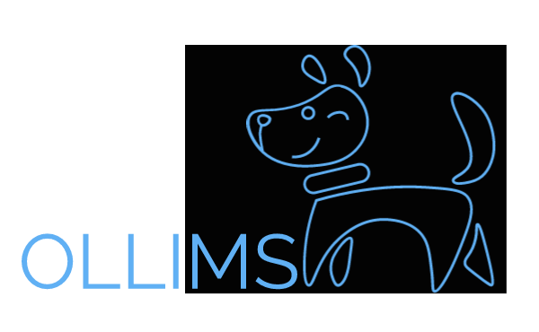

<h2>Wagging his tail from the excitement of managing your laboratory systems! </h2>

This project is only just starting out, aiming to grow as time goes. We will start by collecting SOP's for cleaning, calibration/validation checks etc for each instrument located in each laboratory and keeping training records. 

Different access levels allow different types of employees to edit/view different parts of the system.

Created the free logo using <a href = https://logomakr.com >LogoMaker</a>.

